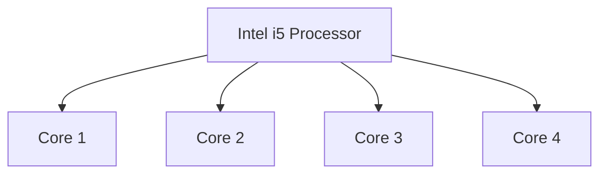
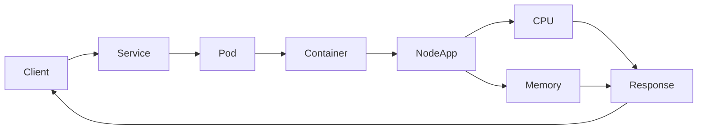
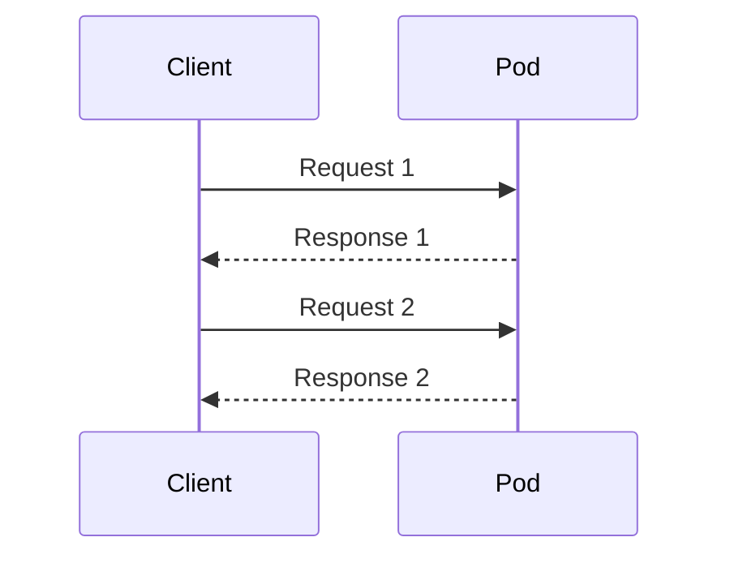
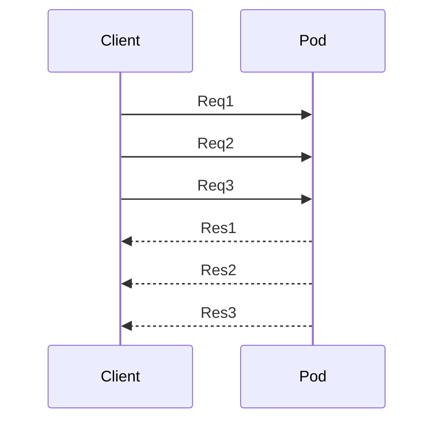
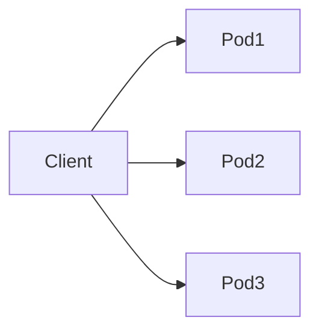
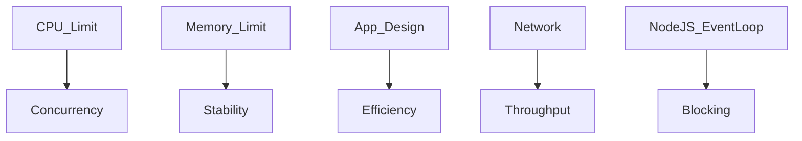
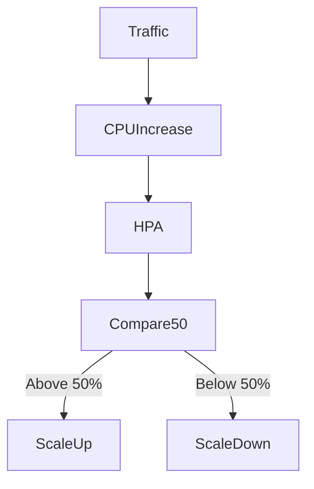

# 📊 Capacity Planning & Internal Architecture – Node.js + Kubernetes

- ✅ CPU core explanation (Intel i5 vs Kubernetes CPU)
- ✅ Internal architecture diagrams
- ✅ Request lifecycle
- ✅ Concurrency vs parallel vs sequential
- ✅ Capacity planning formula for your Node app
- ✅ How to predict scaling
- ✅ How HPA actually calculates
- ✅ How to estimate before production

---

## 1️⃣ What Is a CPU Core? (Hardware Level)

### When we say

- Intel Core i5
- That is a processor model name.
- Inside that processor are multiple CPU cores.

### 🏗 Hardware Architecture



**What is a Core?**

- A core:
  - Executes instructions
  - Runs processes
  - Works independently from other cores

**If you have:**

```bash
# To see the cores run this in terminal
nproc

# Response
20

# You have 20 logical CPUs available.
```

---

## 2️⃣ Kubernetes CPU vs Hardware CPU

Kubernetes does NOT create CPU.

It only limits how much of the real CPU your pod can use.

**Extra Simple Explanation:**

- m = millicores

- 1000m = 1 full CPU core

- So:

  - 100m = small amount of CPU

  - 500m = medium amount

  - 1000m = full core

Here’s the same table explained in simpler terms:

| Kubernetes CPU | Meaning             | Calculation        | What It Really Means (Simple)       |
|----------------|-------------------|------------------|----------------------------------|
| 100m           | 0.1 CPU core       | 100 ÷ 1000 = 0.1 | Uses 10% of one CPU core         |
| 250m           | 0.25 CPU core      | 250 ÷ 1000 = 0.25| Uses 25% of one CPU core         |
| 500m           | 0.5 CPU core       | 500 ÷ 1000 = 0.5 | Uses half of one CPU core        |
| 1000m          | 1 full CPU core    | 1000 ÷ 1000 = 1  | Uses one full CPU core           |
| 2000m          | 2 full CPU cores   | 2000 ÷ 1000 = 2  | Uses two full CPU cores          |

**If node has 20 cores and pod limit is:**

```bash
cpu: 500m
```

That pod can use only 0.5 out of 20 cores.

---

## 3️⃣ Full Request Flow – Internal Architecture



### What happens internally

- Client sends HTTP request
- Kubernetes Service forwards to one Pod
- Container receives request
- Node.js processes it
- CPU does computation
- Memory stores temporary data
- Response returned

---

## 4️⃣ Sequential vs Concurrent vs Parallel

🔹 **Sequential**

One request at a time.



🔹 **Concurrent (Node.js style)**

Node.js:

- Single-threaded
- Uses event loop
- Handles many I/O requests concurrently



🔹 **Parallel (Multiple Cores / Pods)**

Each pod may run on different CPU cores.

True parallelism.



## 5️⃣ CPU & Memory Usage Model

### CPU

- Handles computation
- JSON parsing
- Encryption
- Business logic

If CPU limit exceeded:

➡ Pod is throttled

➡ Response becomes slow

### Memory

- Stores request body
- Buffers
- Variables

Response data

If memory limit exceeded:

➡ Pod crashes (OOMKilled)

---

## 6️⃣ Capacity Planning Formula (For Your Node App)

### Step 1: Measure CPU per request

```bash
# Run small test:
kubectl top pod -n dev

# Before load:
CPU: 20m

# After 10 requests:
CPU: 120m

# Difference:
100m for 10 requests

# So:
CPU per request ≈ 10m

```

### Step 2: Calculate Max Concurrent Requests

```bash
# Your pod limit:
cpu: 500m

# So:
500m / 10m = 50 concurrent requests

That means:

One pod can roughly handle 50 active CPU-heavy requests.
```

### Step 3: Estimate Requests Per Second

```bash
# If one request takes:
50ms CPU time

# Then per second:
1000ms / 50ms = 20 requests per execution slot

# Total theoretical capacity:
50 concurrent × 20 = 1000 req/sec

# Note: Reality will be lower (network, GC, overhead).
```

---

## 7️⃣ What Decides Concurrency Capacity?

Main parameters:

- CPU limit
- Memory limit
- Request processing time
- Blocking vs non-blocking code
- Network latency



---

## 8️⃣ How HPA Calculates Scaling

```bash
# HPA uses this formula:
CPU Utilization % = (Current CPU usage / CPU request) × 100

# Example:
requests:
  cpu: 100m

# If usage = 80m
80 / 100 × 100 = 80%

# If HPA target is:
averageUtilization: 50

# Since 80% > 50%
➡ HPA creates new pod
```

---

## 9️⃣ Full HPA Decision Flow

**Important:**

HPA compares against CPU request, not limit.



---

## 🔟 How To Predict Before Production

**To estimate capacity:**

- Measure CPU per request
- Measure average response time

*Apply formula:*

```bash
Max concurrency per pod = CPU limit / CPU per request

# Then:
Total capacity = (Max concurrency per pod × number of pods)

```

---

## 🔥 Final Understanding

**System capacity depends on:**

- Hardware cores
- Kubernetes CPU limits
- Number of pods
- App efficiency
- HPA config

## Lets do practical

### Measure CPU per request

```bash
# 1️⃣ Check your pod name
kubectl get pods -n dev

# Example output:
# NAME                                      READY   STATUS    RESTARTS   AGE
# kubernetes-node-server-6f6d664f4c-s6ncn   1/1     Running   0          17h

# 2️⃣ Check CPU usage before traffic
kubectl top pod kubernetes-node-server-6f6d664f4c-s6ncn -n dev

# Example:
# NAME                                      CPU(cores)   MEMORY(bytes)
# kubernetes-node-server-6f6d664f4c-s6ncn   20m         130Mi

# 3️⃣ Generate load (e.g., 10 requests)
for i in {1..10}; do
  curl -s http://192.168.29.13:32051/api/hello > /dev/null
done

# 4️⃣ Check CPU again
kubectl top pod kubernetes-node-server-6f6d664f4c-s6ncn -n dev

# Example after 10 requests:
# CPU(cores): 120m

# 5️⃣ Calculate CPU per request (millicores)
# CPU per request = (CPU after - CPU before) / number of requests
# Example: (120m - 20m) / 10 = 10m CPU per request
# ✅ This gives an approximate CPU cost per request

# Pod CPU limit from deployment
resources:
  limits:
    cpu: 500m   # Maximum CPU pod can use

# Max concurrent requests
# ⚠️ This is theoretical; Node.js is single-threaded
MaxConcurrent=$((500 / 10))  # CPU limit / CPU per request
echo "Max concurrent requests (theoretical): $MaxConcurrent"
# Example: 500m / 10m = 50 requests at a time per pod

# 1️⃣ Measure request duration in seconds
time curl -s http://192.168.29.13:32051/api/hello > /dev/null

# 2️⃣ Measure request duration programmatically (in seconds)
request_time_s=$(curl -s -w "%{time_total}\n" -o /dev/null http://192.168.29.13:32051/api/hello)

# 3️⃣ Convert seconds to milliseconds
request_time_ms=$(echo "$request_time_s * 1000" | bc)
echo "Request time ≈ $request_time_ms ms"

# 4️⃣ Calculate requests per second per execution slot
rps_slot=$(echo "1000 / $request_time_ms" | bc)
echo "Requests per second per execution slot ≈ $rps_slot"

# 5️⃣ Total theoretical capacity per pod
# ⚠️ Use max concurrent * RPS per slot
total_theoretical=$(echo "$MaxConcurrent * $rps_slot" | bc)
echo "Total theoretical requests per second per pod ≈ $total_theoretical"

# ✅ Reality will be lower due to:
#    - Node.js single-threaded event loop
#    - Garbage collection
#    - Network latency
#    - Other overhead

```
