# Kubernetes Cluster Networking Diagram

## Multiple NodePorts, Services, Pods, and Nodes

```mermaid
graph TD
    %% ================= EXTERNAL CLIENTS =================
    ClientA[🌎 Client A<br/>IP: 203.0.113.10]
    ClientB[🌎 Client B<br/>IP: 203.0.113.11]

    %% ================= NODE 1 =================
    subgraph Node1[🖥 Node 1<br/>192.168.1.50]
        subgraph DevNS1[Namespace: dev]
            PodA[📦 Pod A<br/>IP:10.1.1.2<br/>Port:3000]
            PodB[📦 Pod B<br/>IP:10.1.1.3<br/>Port:3000]
        end
        subgraph QaNS1[Namespace: qa]
            PodC[📦 Pod C<br/>IP:10.1.1.4<br/>Port:3000]
        end
    end

    %% ================= NODE 2 =================
    subgraph Node2[🖥 Node 2<br/>192.168.1.51]
        subgraph DevNS2[Namespace: dev]
            PodD[📦 Pod D<br/>IP:10.1.1.5<br/>Port:3000]
        end
        subgraph QaNS2[Namespace: qa]
            PodE[📦 Pod E<br/>IP:10.1.1.6<br/>Port:3000]
        end
    end

    %% ================= SERVICES =================
    ServiceDev[🔗 Service Dev<br/>Selector: app=dev-app<br/>NodePort:32051]
    ServiceQA[🔗 Service QA<br/>Selector: app=qa-app<br/>NodePort:32052]

    %% ================= NODEPORT CONNECTIONS =================
    ClientA -->|HTTP:32051| ServiceDev
    ClientB -->|HTTP:32052| ServiceQA

    %% ================= SERVICE TO PODS =================
    ServiceDev --> PodA
    ServiceDev --> PodB
    ServiceDev --> PodD

    ServiceQA --> PodC
    ServiceQA --> PodE

    %% ================= INTERNAL POD COMMUNICATION =================
    PodA ---|Internal| PodB
    PodD ---|Internal| PodA
    PodC ---|Internal| PodE
```



---

## Kubernetes Node + TypeScript API Deployment Notes

### 1️⃣ Node vs Pod IPs

```table
| Component | IP Example                      | Purpose                                                                                                                                          |
| --------- | ------------------------------- | ------------------------------------------------------------------------------------------------------------------------------------------------ |
| **Node**  | 192.168.29.13                   | Physical or virtual machine IP. NodePort services are exposed on the Node IP. Access via `<NodeIP>:<NodePort>` from outside the cluster.         |
| **Pods**  | 192.168.199.74 / 192.168.199.75 | Internal pod IPs. Pods are **not directly accessible** outside the cluster. Traffic is routed via Service (NodePort / ClusterIP / LoadBalancer). |

```

- Request goes to Node IP 192.168.29.13
- NodePort 32051 matches your Service (kubernetes-node-service)
- Service forwards traffic to one of the pods (192.168.199.74 or 192.168.199.75)

### 2️⃣ NodePort / Service Flow

```bash
http://192.168.29.13:32051/api/hello

```



```mermaid
graph TD
    %% External access
    INTERNET[🌎 External Client] -->|NodeIP:NodePort| NODE[🖥 Node 192.168.29.13]

    %% Service
    NODE -->|Port 32051| SERVICE[🔗 Kubernetes NodePort Service<br>Selector: app=kubernetes-node-server]

    %% Pods behind Service
    SERVICE --> POD1[📦 Pod 192.168.199.74]
    SERVICE --> POD2[📦 Pod 192.168.199.75]

```

### 3️⃣ Firewall Setup (Ubuntu + UFW)

```bash
# Allow a specific NodePort
sudo ufw allow 32051/tcp

# Allow full NodePort range (30000-32767)
sudo ufw allow 30000:32767/tcp

# Check firewall status
sudo ufw status

# Enable firewall (if inactive)
sudo ufw enable

# Reload firewall (after changes)
sudo ufw reload
```

**✅ Note: NodePort range in Kubernetes defaults to 30000–32767. Any NodePort assigned outside this range will fail.**

### 4️⃣ Kubernetes Commands Reference

```bash
# Pods & Deployments
kubectl get pods
kubectl get deployments
kubectl describe pod <pod-name>
kubectl logs <pod-name>
kubectl rollout restart deployment <deployment-name>
kubectl delete deployment <deployment-name>

# Services
kubectl get svc
kubectl get svc -A          # all namespaces
kubectl describe svc <svc>
kubectl delete svc <svc-name>

# NodePort Management
kubectl get svc --all-namespaces -o wide
# Assign NodePort manually: choose a free number between 30000–32767
# Let Kubernetes assign automatically: omit `nodePort` in service YAML
```

---

## Kubernetes Internal Communication Best Practices

### 1️⃣ Node vs Pod IPs

### 2️⃣ Internal Communication Principles

- Use Service DNS for pod-to-pod communication
  - Pods are ephemeral; IPs change on restart.
  - Use Service DNS for stable access:

```bash
http://user-service.default.svc.cluster.local:3000/api/users
```

- One Deployment per microservice
  - Independent scaling.
  - Rolling updates without downtime.
  - Fault isolation per microservice.

- One Service per Deployment
  - Usually ClusterIP for internal communication.
  - Expose NodePort / LoadBalancer only for external traffic.

```yaml
apiVersion: v1
kind: Service
metadata:
  name: user-service
spec:
  type: ClusterIP           # Internal communication only
  selector:
    app: user-service       # Routes traffic to pods with this label
  ports:
    - port: 3000
      targetPort: 3000
```

- Use selectors to route traffic
  - Service selector matches pod labels.
  - Service acts as a stable endpoint for dynamic pods:

```yaml
spec:
  selector:
    app: user-service
```

**Kubernetes DNS ensures any pod using the service name reaches the correct pods.**

### 3️⃣ Commands to Check and Test

```bash
# List all pods with IPs
kubectl get pods -o wide

# List all services and their ClusterIP
kubectl get svc

# Test internal communication from a pod
kubectl exec -it <pod-of-service-a> -- curl http://service-b:3001/api/hello

# Restart pods (rolling update)
kubectl rollout restart deployment <deployment-name>

# Delete pod (it will auto-recreate via Deployment)
kubectl delete pod <pod-name>
```

### 4️⃣ External Access (Optional)

Use NodePort or LoadBalancer only for external clients.

Example:

```yaml
spec:
  type: NodePort
  ports:
    - port: 3000
      targetPort: 3000
      nodePort: 32051
```

### Access in browser

```yaml
http://<NodeIP>:<NodePort>/api/hello
```

✅ Summary:

- ClusterIP → internal traffic between pods.
- Service DNS → stable endpoint for ephemeral pods
- One Deployment + One Service per microservice → simplifies scaling, updates, and communication
- NodePort / LoadBalancer → external access only.
