# 🗺 Kubernetes Roadmap (Ubuntu Edition)

A complete roadmap from **Beginner → Advanced → Pro**, focusing on **9 key modules** plus optional advanced tools. Learn everything from concepts to tools, real-world operations, and pro-level practices.

---

## 🧠 Kubernetes Mental Model (Think Like the Control Plane)

- You declare YAML → API Server stores it in etcd  
- Controllers watch etcd → try to match desired state  
- Scheduler picks a node  
- Kubelet pulls image & runs container  
- Kubernetes keeps fixing things until reality = desired state  

**Pro habit:**  
When something breaks, ask:  
> “Which component is failing to reconcile the desired state?”

---

## 1️⃣ Core Kubernetes Concepts (Foundation)

**Goal:** Understand what Kubernetes manages.

**Overview:** Core concepts are the building blocks. They define **what the system manages, how it organizes resources, and the desired state of applications**.

### Concepts & Keywords:
- **Cluster:** Set of nodes (machines) running Kubernetes.  
  *Use:* Top-level scope of Kubernetes.  
- **Node (Master / Worker):** Master controls the cluster, Workers run workloads.  
- **Pod:** Smallest deployable unit; contains one or more containers.  
- **Container (Docker / containerd / CRI-O):** Runs apps inside pods.  
- **YAML manifests:** Declarative definition of objects.  
- **Desired State:** Kubernetes ensures reality matches your YAML.  
- **Labels & Annotations:** Metadata for selection & organization.

### Tools & Commands:
- `kubectl get pods`, `kubectl describe pod`  
- `minikube`, `kind`  
- `docker ps` / `crictl ps`  

### Practical Skills:
- Deploy simple pods/services  
- Inspect objects & desired state  
- Practice **debugging failures** like Pending pods or CrashLoopBackOff  

---

## 2️⃣ Control Plane Components (Brain)

**Goal:** Know who decides what runs where.

**Overview:** The control plane is the **“brain”** of Kubernetes. It makes scheduling decisions, maintains cluster state, and exposes APIs to users.

### Components:
- **kube-apiserver:** Central API for all operations  
- **etcd:** Key-value store for cluster state  
- **kube-scheduler:** Decides pod placement  
- **kube-controller-manager:** Ensures desired state  

**When & Why:** Always running on master nodes; critical for reliability.  

### Tools & Commands:
- `kubectl get componentstatuses`  
- `etcdctl`  
- `kubectl get nodes -o wide`  

### Practical Skills:
- Explore API requests  
- Inspect etcd key-value store  
- Observe scheduler & controllers  

---

## 3️⃣ Worker Node Components (Execution Layer)

**Goal:** Understand how containers run.

**Overview:** Worker nodes **execute workloads, manage pods, and provide networking**.

### Components:
- **kubelet:** Node agent; ensures pods run  
- **kube-proxy:** Handles service networking  
- **Container Runtime:** Docker / containerd / CRI-O  

**When & Why:** Required for all nodes to participate in the cluster.

### Tools & Commands:
- `systemctl status kubelet`  
- `kubectl logs <pod>`  
- `kubectl exec -it <pod> -- /bin/bash`  

### Practical Skills:
- Debug pods failing to start  
- Explore node resources  
- Understand service routing  

---

## 4️⃣ Kubernetes Objects (Daily Work)

**Goal:** Define and manage applications.

**Overview:** Objects are **declarative entities you create**. Kubernetes manages them to match your desired state.

### Objects & Keywords:
- Pod, ReplicaSet, Deployment, StatefulSet, DaemonSet  
- Service (ClusterIP, NodePort, LoadBalancer)  
- ConfigMap, Secret, Namespace  
- PersistentVolume (PV), PersistentVolumeClaim (PVC)

**When & Why:** Use whenever you deploy apps.  

### Tools:
- `kubectl`  
- Helm → package & deploy apps  
- Kustomize → YAML templating  

### Practical Skills:
- Deploy apps via YAML & Helm  
- Update apps with zero downtime  
- Organize namespaces for teams  

---

## 5️⃣ Networking (Traffic Flow)

**Goal:** Control cluster communication.

**Overview:** Networking **connects pods, services, and external clients**, enabling service discovery and traffic routing.

### Concepts & Keywords:
- Pod-to-Pod communication  
- Services: ClusterIP, NodePort, LoadBalancer, ExternalName  
- DNS & CoreDNS, NetworkPolicies  
- Ingress & IngressController  
- Service Mesh: Istio / Linkerd  

**When & Why:** Required for all cluster communication & isolation.

### Tools:
- CNI Plugins: Calico, Flannel, Weave, Cilium  
- `kubectl get svc` / `kubectl describe svc`  
- `kubectl port-forward` / `kubectl exec`  

### Practical Skills:
- Deploy services & ingress  
- Test pod connectivity  
- Apply network policies  

---

## 6️⃣ Storage (Persistence)

**Goal:** Manage stateful workloads.

**Overview:** Kubernetes **handles persistent storage for pods**, essential for databases and other stateful apps.

### Concepts & Keywords:
- Volumes: emptyDir, hostPath, configMap, secret  
- PV, PVC, StorageClass  
- CSI drivers (AWS EBS, GCP PD, Azure Disk, NFS)

**When & Why:** Use when data must survive pod restarts.  

### Tools & Commands:
- `kubectl get pv`, `kubectl get pvc`  
- `kubectl describe pv/pvc`  

### Practical Skills:
- Deploy StatefulSets  
- Dynamic volume provisioning  
- Backup & restore data  

---

## 7️⃣ Scheduling & Scaling

**Goal:** Control pod placement and resource usage.

**Overview:** Scheduler & scaling features **optimize resource usage and adapt workloads to demand**.

### Concepts & Keywords:
- NodeSelector, Affinity/Anti-Affinity, Taints & Tolerations  
- HPA / VPA, Cluster Autoscaler  
- Labels & Selectors  

**When & Why:** Optimize performance, availability, and load.  

### Tools:
- Metrics Server (`kubectl top`)  
- Prometheus / Grafana  

### Practical Skills:
- Schedule pods on specific nodes  
- Autoscale based on metrics  
- Implement affinity rules  

---

## 8️⃣ Configuration & Security

**Goal:** Secure your cluster and workloads.

**Overview:** Configurations & security **protect cluster integrity and control access**.

### Concepts & Keywords:
- RBAC: Role, ClusterRole, RoleBinding  
- ServiceAccounts, Secrets, ConfigMaps  
- NetworkPolicies, PodSecurityPolicies  
- TLS, Certificates, OPA / Kyverno  

**When & Why:** Ensure least privilege, policy enforcement, and isolation.  

### Tools:
- `kubectl auth can-i`  
- `kubectl create secret`  
- `kube-bench`, `trivy`  

### Practical Skills:
- Secure apps & clusters  
- Encrypt secrets  
- Apply network isolation  
- Audit vulnerabilities  

---

## 9️⃣ Observability & Maintenance

**Goal:** Operate Kubernetes like a pro.

**Overview:** Observability ensures **health, reliability, and quick troubleshooting**.

### Concepts & Keywords:
- Logs, Metrics, Health Checks (liveness/readiness)  
- kubectl debugging, Cluster upgrades  
- Backup & Restore, Etcd snapshots  

### Tools:
- Prometheus & Grafana  
- Loki & Fluentd / ELK Stack  
- Velero, Lens / Octant, k9s, stern  

### Practical Skills:
- Monitor metrics & logs  
- Debug workloads  
- Upgrade clusters safely  
- Backup & restore state  

---

## 🔟 Optional Advanced Tools & Ecosystem

**Goal:** Explore the Kubernetes ecosystem for professional workloads.

- Helm → Package manager for apps  
- Kustomize → YAML templating  
- Istio / Linkerd → Service mesh  
- ArgoCD / Flux → GitOps deployment  
- Kubeflow → ML workloads on Kubernetes  
- Terraform / Ansible → Infrastructure as code for K8s  
- OPA / Kyverno → Policy enforcement  

---

## ⚔ kubectl Mastery

- kubectl get / describe / explain  
- kubectl logs --previous  
- kubectl exec -it  
- kubectl diff  
- kubectl rollout undo  
- kubectl auth can-i  
- kubectl debug  

**Pro habit:** Always alias: `alias k=kubectl`

---

## 📄 YAML Best Practices

- Always set `resources.requests` & `limits`  
- Liveness & readiness probes  
- Labels: app, env, version  
- Never hardcode secrets  
- Use ConfigMaps for configs  

---

## ✅ Production Readiness Checklist

Before deploying:
- Health checks configured  
- Resource limits set  
- Logs & metrics exposed  
- Secrets secured  
- NetworkPolicies applied  
- Backup strategy exists  

---

## 🔁 GitOps Mindset

- Git = source of truth  
- PR → review → merge  
- ArgoCD / Flux syncs cluster  
- No manual changes in prod  

---

## ☁ Cloud Reality Check

Focus on at least one:  
- AWS EKS, GCP GKE, Azure AKS  

Understand:
- LoadBalancers, IAM integration, storage classes, autoscaling  

---

## 🔐 Kubernetes Security Mindset

- Least privilege RBAC  
- No root containers  
- Scan images before deploy  
- Network isolation by default  
- Secrets never in Git  

---

## 💡 Tips & Pro Advice

- Start with **minikube** or **kind**  
- Move to **multi-node kubeadm clusters**  
- Combine kubectl, Helm, Kustomize, Prometheus/Grafana, Velero  
- Practice **networking, storage, RBAC, scaling**  
- Explore **service mesh & GitOps**  
- Always **backup etcd before upgrades**  

---

> 🚀 Following this roadmap with hands-on practice will make you a **confident Kubernetes professional**, capable of designing, deploying, securing, and maintaining production-grade clusters on Ubuntu.

## Complete For pro

```mermaid
graph TD
    %% ================= USER / EXTERNAL =================
    U[👤 User / DevOps Engineer<br/>kubectl · YAML · CI/CD · GitOps] -->|Apply Manifest / Create / Update / Delete| API[🧠 kube-apiserver<br/>Validation · Auth · Admission · REST API]

    %% ================= ETCD =================
    API -->|Store Desired State / Read Actual State| ETCD[(🗄 etcd<br/>Cluster State DB<br/>Single Source of Truth)]

    %% ================= CONTROL PLANE =================
    API -->|Trigger Reconciliation / Detect Drift| CTRL[⚙ kube-controller-manager<br/>ReplicaSet · Deployment · StatefulSet · DaemonSet · Self-Healing · Auto-Scaling]
    CTRL -->|State Mismatch Feedback| API

    API -->|Schedule Pod / Node Selection| SCH[📍 kube-scheduler<br/>CPU · Memory · Affinity / Anti-Affinity · Taints & Tolerations · Constraints]
    SCH -->|Binding Decision| API

    %% ================= WORKER NODE =================
    API -->|Assign PodSpec| KUBELET[🖥 kubelet<br/>Pod Lifecycle · Health Checks · Node Agent]

    %% ================= POD / CONTAINER =================
    KUBELET -->|Create & Manage| POD[📦 Pod<br/>Containers · Volumes · IP · Labels · Namespace]
    POD -->|Run Application| CTR[🐳 Container<br/>App Process · Liveness & Readiness Probes]

    %% ================= CONFIG / SECRET =================
    POD -->|Consume Config| CONFIG[🗃 ConfigMap / Secret<br/>Env / Volumes]

    %% ================= NETWORKING =================
    POD -->|Service Traffic| PROXY[🌐 kube-proxy<br/>Service Networking · Load Balancing · iptables / IPVS]
    PROXY -->|Forward Requests| POD

    %% ================= SERVICES / INGRESS =================
    POD -->|Exposed via| SVC[🔗 Service<br/>ClusterIP · NodePort · LoadBalancer · ExternalName]
    SVC -->|Route Traffic| PROXY
    SVC -->|Ingress Controller| INGRESS[🌉 Ingress / IngressController<br/>Routing · TLS]
    INGRESS -->|External Traffic| INTERNET[🌎 Internet / External Clients]

    %% ================= STORAGE =================
    POD -->|Persistent Storage| PV[💾 PersistentVolume / PVC<br/>CSI Drivers · StorageClass]
    
    %% ================= SCHEDULING & SCALING =================
    SCH -->|Scaling Feedback| HPA[📈 HPA / VPA / Cluster Autoscaler]
    HPA -->|Adjust Replicas / Resources| CTRL

    %% ================= CONFIGURATION & SECURITY =================
    POD -->|Security / Access| RBAC[🔐 RBAC · Roles · RoleBindings · ServiceAccounts]
    CONFIG -->|Secrets / Config| RBAC
    POD -->|Network Isolation| NETPOL[🛡 Network Policies]

    %% ================= OBSERVABILITY & MAINTENANCE =================
    POD -->|Metrics / Logs| MON[📊 Prometheus · Grafana · Loki / Fluentd / ELK]
    MON -->|Health / Alerts| CTRL
    API -->|Cluster Backup / Restore| BACKUP[💾 Velero / Etcd Snapshots / Cluster Backups]

    %% ================= ADVANCED TOOLS / OPTIONAL =================
    U -->|Deploy via Helm / Kustomize| HELM[📦 Helm Charts / Kustomize<br/>YAML Templating]
    HELM --> API

    U -->|GitOps CI/CD| GITOPS[🔄 ArgoCD / Flux · GitOps Sync]
    GITOPS --> API

    POD -->|Service Mesh| MESH[🌐 Istio / Linkerd<br/>Traffic Routing / Observability]
    MESH --> PROXY

    POD -->|ML Workloads| KUBEFLOW[🤖 Kubeflow · AI / ML Pipelines]
    KUBEFLOW --> POD

    %% ================= HEALTH & STATUS =================
    CTR -->|Health Status / Exit Code| KUBELET
    KUBELET -->|Node / Pod Status / Heartbeat| API

    %% ================= STYLES =================
    classDef user fill:#E3F2FD,stroke:#1E88E5,stroke-width:2px,color:#0D47A1;
    classDef api fill:#FFF3E0,stroke:#FB8C00,stroke-width:2px,color:#E65100;
    classDef state fill:#E8F5E9,stroke:#43A047,stroke-width:2px,color:#1B5E20;
    classDef control fill:#FFFDE7,stroke:#F9A825,stroke-width:2px,color:#F57F17;
    classDef scheduler fill:#FFE0B2,stroke:#FB8C00,stroke-width:2px,color:#E65100;
    classDef node fill:#F3E5F5,stroke:#8E24AA,stroke-width:2px,color:#4A148C;
    classDef workload fill:#FCE4EC,stroke:#D81B60,stroke-width:2px,color:#880E4F;
    classDef network fill:#E3F2FD,stroke:#1E88E5,stroke-width:2px,color:#0D47A1;
    classDef config fill:#FFFDE7,stroke:#8E24AA,stroke-width:2px,color:#4A148C;
    classDef storage fill:#E0F2F1,stroke:#00796B,stroke-width:2px,color:#004D40;
    classDef observability fill:#FFEBEE,stroke:#D32F2F,stroke-width:2px,color:#B71C1C;
    classDef advanced fill:#E8EAF6,stroke:#3949AB,stroke-width:2px,color:#1A237E;

    %% ================= APPLY CLASSES =================
    class U user;
    class API api;
    class ETCD state;
    class CTRL control;
    class SCH scheduler;
    class KUBELET node;
    class POD,CTR workload;
    class PROXY,INTERNET,SVC,INGRESS network;
    class CONFIG,RBAC,NETPOL config;
    class PV storage;
    class HPA observability;
    class MON,BACKUP observability;
    class HELM,GITOPS,MESH,KUBEFLOW advanced;

```

## Show flow: User → Control Plane → Worker → Pods → Networking / Storage / Observability / Advanced Tools

simplified, one-page Kubernetes architecture diagram

```mermaid
graph TD
    %% ================= USER / CI-CD =================
    U[👤 User / DevOps Engineer<br/>kubectl · YAML · CI/CD · GitOps] -->|Apply Manifest| API[🧠 API Server<br/>Validation · Auth · Admission]

    %% ================= CONTROL PLANE =================
    API --> ETCD[(🗄 etcd<br/>Cluster State)]
    API --> CTRL[⚙ Controller Manager<br/>Self-Healing · Scaling]
    API --> SCH[📍 Scheduler<br/>Pod Placement · Affinity / Taints]

    %% ================= WORKER NODE =================
    API --> KUBELET[🖥 Kubelet<br/>Pod Lifecycle · Health Checks]
    KUBELET --> POD[📦 Pod<br/>Containers · Volumes · IP · Labels]
    POD --> CTR[🐳 Container<br/>App Process · Probes]

    %% ================= CONFIG / SECRET =================
    POD --> CONFIG[🗃 ConfigMap / Secret]

    %% ================= NETWORKING =================
    POD --> PROXY[🌐 kube-proxy / Services]
    PROXY --> INGRESS[🌉 Ingress Controller<br/>Routing · TLS]
    INGRESS --> INTERNET[🌎 External Traffic]

    %% ================= STORAGE =================
    POD --> PV[💾 PersistentVolume / PVC<br/>CSI Drivers]

    %% ================= SCALING =================
    SCH --> HPA[📈 HPA / VPA / Cluster Autoscaler]
    HPA --> CTRL

    %% ================= SECURITY =================
    POD --> RBAC[🔐 RBAC · Roles · ServiceAccounts]
    CONFIG --> RBAC
    POD --> NETPOL[🛡 Network Policies]

    %% ================= OBSERVABILITY =================
    POD --> MON[📊 Prometheus / Grafana / Logs]
    MON --> CTRL
    API --> BACKUP[💾 Velero / Etcd Snapshots]

    %% ================= ADVANCED / OPTIONAL =================
    U --> HELM[📦 Helm / Kustomize]
    HELM --> API
    U --> GITOPS[🔄 ArgoCD / Flux · GitOps]
    GITOPS --> API
    POD --> MESH[🌐 Service Mesh · Istio / Linkerd]
    MESH --> PROXY
    POD --> KUBEFLOW[🤖 Kubeflow / ML Pipelines]

    %% ================= HEALTH STATUS =================
    CTR -->|Health Status| KUBELET
    KUBELET -->|Node / Pod Status| API

    %% ================= STYLES =================
    classDef user fill:#E3F2FD,stroke:#1E88E5,stroke-width:2px,color:#0D47A1;
    classDef api fill:#FFF3E0,stroke:#FB8C00,stroke-width:2px,color:#E65100;
    classDef control fill:#FFFDE7,stroke:#F9A825,stroke-width:2px,color:#F57F17;
    classDef scheduler fill:#FFE0B2,stroke:#FB8C00,stroke-width:2px,color:#E65100;
    classDef node fill:#F3E5F5,stroke:#8E24AA,stroke-width:2px,color:#4A148C;
    classDef workload fill:#FCE4EC,stroke:#D81B60,stroke-width:2px,color:#880E4F;
    classDef network fill:#E3F2FD,stroke:#1E88E5,stroke-width:2px,color:#0D47A1;
    classDef config fill:#FFFDE7,stroke:#8E24AA,stroke-width:2px,color:#4A148C;
    classDef storage fill:#E0F2F1,stroke:#00796B,stroke-width:2px,color:#004D40;
    classDef observability fill:#FFEBEE,stroke:#D32F2F,stroke-width:2px,color:#B71C1C;
    classDef advanced fill:#E8EAF6,stroke:#3949AB,stroke-width:2px,color:#1A237E;

    %% ================= APPLY CLASSES =================
    class U user;
    class API api;
    class ETCD control;
    class CTRL control;
    class SCH scheduler;
    class KUBELET node;
    class POD,CTR workload;
    class CONFIG config;
    class PROXY,INGRESS,INTERNET network;
    class PV storage;
    class HPA observability;
    class RBAC,NETPOL config;
    class MON,BACKUP observability;
    class HELM,GITOPS,MESH,KUBEFLOW advanced;

```

---

## ✅ What This Workflow Shows (Engine)

Perfect! Let’s create a Kubernetes Engine & Workflow diagram that shows how a request flows from user → API Server → Control Plane → Scheduler → Worker → Pod → Container → Networking / Storage, all in one execution workflow.

This will clearly show alignment of components and execution order.

```mermaid
graph TD
    %% ================= STEP 1: USER SUBMITS =================
    U[👤 Developer / DevOps<br/>kubectl · YAML · CI/CD] -->|1️⃣ Submit Deployment / Manifest| API[🧠 kube-apiserver<br/>Validates, Auth, Admission]

    %% ================= STEP 2: STORE DESIRED STATE =================
    API -->|2️⃣ Persist Desired State| ETCD[(🗄 etcd<br/>Cluster State DB)]

    %% ================= STEP 3: CONTROLLERS WATCH =================
    ETCD -->|3️⃣ Watch & Detect Drift| CTRL[⚙ Controller Manager<br/>Self-Healing · Replica / Node / Endpoint Controllers]

    %% ================= STEP 4: SCHEDULING =================
    CTRL -->|4️⃣ Need Node Assignment| SCH[📍 Scheduler<br/>Node Selection · Affinity / Taints / Constraints]
    SCH -->|5️⃣ Bind Pod to Node| API

    %% ================= STEP 5: KUBELET EXECUTION =================
    API -->|6️⃣ Send PodSpec to Node| KUBELET[🖥 Kubelet<br/>Pod Lifecycle Management · Health Checks]
    KUBELET -->|7️⃣ Pull Container Image| CONTAINERD[🐳 Container Runtime<br/>Docker / containerd / CRI-O]

    %% ================= STEP 6: POD & CONTAINER =================
    KUBELET -->|8️⃣ Create Pod| POD[📦 Pod<br/>Networking, Volumes, Labels, Namespace]
    POD -->|9️⃣ Start App Container| CTR[🐳 Container<br/>App Process, Liveness / Readiness Probes]

    %% ================= STEP 7: CONFIGURATION =================
    POD -->|🔧 Apply Config / Secrets| CONFIG[🗃 ConfigMap / Secret]

    %% ================= STEP 8: NETWORKING =================
    POD -->|🔗 Configure Networking| PROXY[🌐 kube-proxy<br/>Service Networking · Load Balancing]
    PROXY --> SVC[🔗 Service<br/>ClusterIP / NodePort / LoadBalancer]
    SVC --> INGRESS[🌉 Ingress / IngressController<br/>Routing · TLS]
    INGRESS --> INTERNET[🌎 External Clients]

    %% ================= STEP 9: STORAGE =================
    POD -->|💾 Attach Volume| PV[PersistentVolume / PVC · CSI Drivers]

    %% ================= STEP 10: SCALING =================
    SCH -->|📈 Trigger Autoscale| HPA[HPA / VPA / Cluster Autoscaler]
    HPA --> CTRL

    %% ================= STEP 11: OBSERVABILITY =================
    CTR -->|📊 Emit Metrics / Logs| MON[Prometheus / Grafana / Loki / Fluentd]
    MON --> CTRL
    KUBELET -->|Node / Pod Status| API

    %% ================= STEP 12: SECURITY =================
    POD -->|🔐 Enforce Access| RBAC[RBAC · ServiceAccounts]
    CONFIG --> RBAC
    POD -->|🛡 Apply Policies| NETPOL[Network Policies]

    %% ================= STEP 13: ADVANCED TOOLS =================
    U --> HELM[📦 Helm / Kustomize · Deployment]
    HELM --> API
    U --> GITOPS[🔄 ArgoCD / Flux · GitOps]
    GITOPS --> API
    POD --> MESH[🌐 Service Mesh · Istio / Linkerd]
    MESH --> PROXY
    POD --> KUBEFLOW[🤖 Kubeflow / ML Pipelines]

    %% ================= STEP 14: FEEDBACK LOOP =================
    CTR -->|🔄 Crash / Exit Code| KUBELET
    KUBELET -->|⚠ Node / Pod Status| API
    CTRL -->|♻ Reconcile Drift| KUBELET

    %% ================= STYLES =================
    classDef user fill:#E3F2FD,stroke:#1E88E5,stroke-width:2px,color:#0D47A1;
    classDef api fill:#FFF3E0,stroke:#FB8C00,stroke-width:2px,color:#E65100;
    classDef control fill:#FFFDE7,stroke:#F9A825,stroke-width:2px,color:#F57F17;
    classDef scheduler fill:#FFE0B2,stroke:#FB8C00,stroke-width:2px,color:#E65100;
    classDef node fill:#F3E5F5,stroke:#8E24AA,stroke-width:2px,color:#4A148C;
    classDef workload fill:#FCE4EC,stroke:#D81B60,stroke-width:2px,color:#880E4F;
    classDef network fill:#E3F2FD,stroke:#1E88E5,stroke-width:2px,color:#0D47A1;
    classDef config fill:#FFFDE7,stroke:#8E24AA,stroke-width:2px,color:#4A148C;
    classDef storage fill:#E0F2F1,stroke:#00796B,stroke-width:2px,color:#004D40;
    classDef observability fill:#FFEBEE,stroke:#D32F2F,stroke-width:2px,color:#B71C1C;
    classDef advanced fill:#E8EAF6,stroke:#3949AB,stroke-width:2px,color:#1A237E;

    %% ================= APPLY CLASSES =================
    class U user;
    class API api;
    class ETCD control;
    class CTRL control;
    class SCH scheduler;
    class KUBELET,CONTAINERD node;
    class POD,CTR workload;
    class CONFIG,RBAC,NETPOL config;
    class PROXY,SVC,INGRESS,INTERNET network;
    class PV storage;
    class HPA observability;
    class MON observability;
    class HELM,GITOPS,MESH,KUBEFLOW advanced;

```

