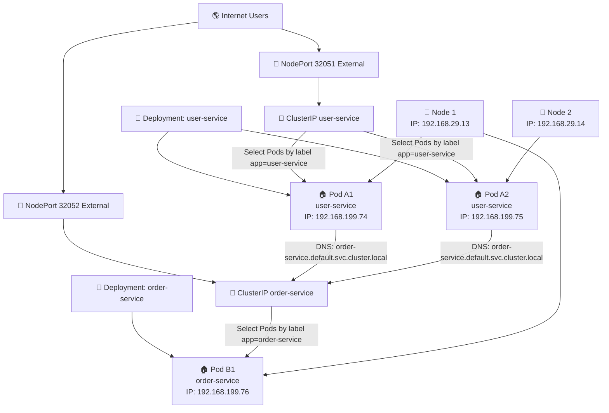

# Kubernetes diagram

```mermaid
graph TD
    %% ================= BUILDINGS & APARTMENTS =================
    Node1[🏢 Node 1<br/>IP: 192.168.29.13] 
    Node2[🏢 Node 2<br/>IP: 192.168.29.14]

    PodA1[🏠 Pod A1<br/>user-service<br/>IP: 192.168.199.74]
    PodA2[🏠 Pod A2<br/>user-service<br/>IP: 192.168.199.75]
    PodB1[🏠 Pod B1<br/>order-service<br/>IP: 192.168.199.76]

    %% ================= DEPLOYMENT MANAGER =================
    DeploymentA[🎩 Deployment: user-service]
    DeploymentB[🎩 Deployment: order-service]

    %% ================= SERVICES =================
    ServiceA[📜 ClusterIP user-service]
    ServiceB[📜 ClusterIP order-service]
    NodePortA[🚪 NodePort 32051 External]
    NodePortB[🚪 NodePort 32052 External]

    %% ================= EXTERNAL USERS =================
    Internet[🌎 Internet Users]

    %% ================= CONNECTIONS =================
    DeploymentA --> PodA1
    DeploymentA --> PodA2
    DeploymentB --> PodB1

    ServiceA -->|Select Pods by label app=user-service| PodA1
    ServiceA -->|Select Pods by label app=user-service| PodA2
    ServiceB -->|Select Pods by label app=order-service| PodB1

    NodePortA --> ServiceA
    NodePortB --> ServiceB
    Internet --> NodePortA
    Internet --> NodePortB

    %% ================= INTERNAL POD COMMUNICATION =================
    PodA1 -->|DNS: order-service.default.svc.cluster.local| ServiceB
    PodA2 -->|DNS: order-service.default.svc.cluster.local| ServiceB

    %% ================= NODES HOSTING PODS =================
    Node1 --> PodA1
    Node1 --> PodB1
    Node2 --> PodA2

```
