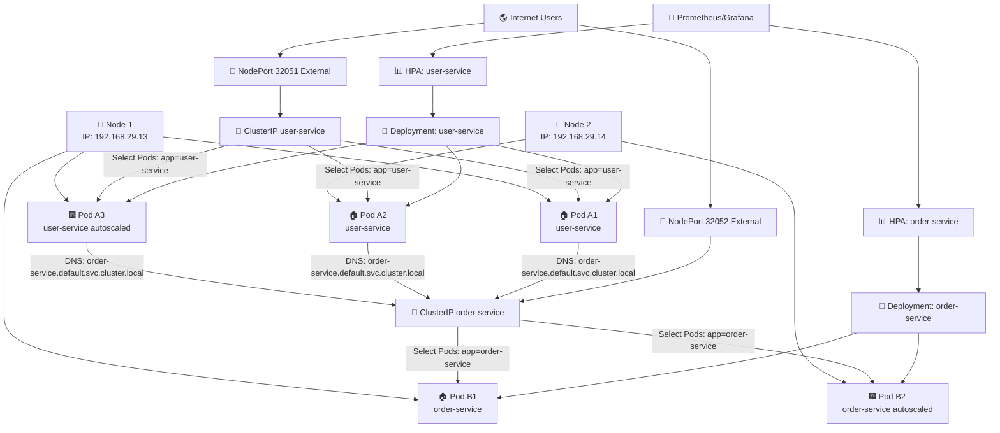

```mermaid
graph TD
    %% ================= NODES =================
    Node1[🏢 Node 1\nIP: 192.168.29.13]
    Node2[🏢 Node 2\nIP: 192.168.29.14]

    %% ================= DEPLOYMENTS =================
    DeploymentA[🎩 Deployment: user-service]
    DeploymentB[🎩 Deployment: order-service]

    %% ================= PODS (AUTOSCALING) =================
    PodA1[🏠 Pod A1\nuser-service]
    PodA2[🏠 Pod A2\nuser-service]
    PodA3[🎆 Pod A3\nuser-service autoscaled]
    PodB1[🏠 Pod B1\norder-service]
    PodB2[🎆 Pod B2\norder-service autoscaled]

    %% ================= SERVICES =================
    ServiceA[📜 ClusterIP user-service]
    ServiceB[📜 ClusterIP order-service]
    NodePortA[🚪 NodePort 32051 External]
    NodePortB[🚪 NodePort 32052 External]

    %% ================= EXTERNAL USERS =================
    Internet[🌎 Internet Users]

    %% ================= HPA & METRICS =================
    HPA_A[📊 HPA: user-service]
    HPA_B[📊 HPA: order-service]
    Metrics[📸 Prometheus/Grafana]

    %% ================= DEPLOYMENT -> POD =================
    DeploymentA --> PodA1
    DeploymentA --> PodA2
    DeploymentA --> PodA3
    DeploymentB --> PodB1
    DeploymentB --> PodB2

    %% ================= SERVICE -> POD SELECTOR =================
    ServiceA -->|Select Pods: app=user-service| PodA1
    ServiceA -->|Select Pods: app=user-service| PodA2
    ServiceA -->|Select Pods: app=user-service| PodA3
    ServiceB -->|Select Pods: app=order-service| PodB1
    ServiceB -->|Select Pods: app=order-service| PodB2

    %% ================= NODEPORT & EXTERNAL ACCESS =================
    NodePortA --> ServiceA
    NodePortB --> ServiceB
    Internet --> NodePortA
    Internet --> NodePortB

    %% ================= INTERNAL POD COMMUNICATION =================
    PodA1 -->|DNS: order-service.default.svc.cluster.local| ServiceB
    PodA2 -->|DNS: order-service.default.svc.cluster.local| ServiceB
    PodA3 -->|DNS: order-service.default.svc.cluster.local| ServiceB

    %% ================= NODES HOSTING PODS =================
    Node1 --> PodA1
    Node1 --> PodB1
    Node1 --> PodA3
    Node2 --> PodA2
    Node2 --> PodB2

    %% ================= HPA & METRICS CONNECTION =================
    HPA_A --> DeploymentA
    HPA_B --> DeploymentB
    Metrics --> HPA_A
    Metrics --> HPA_B

```
